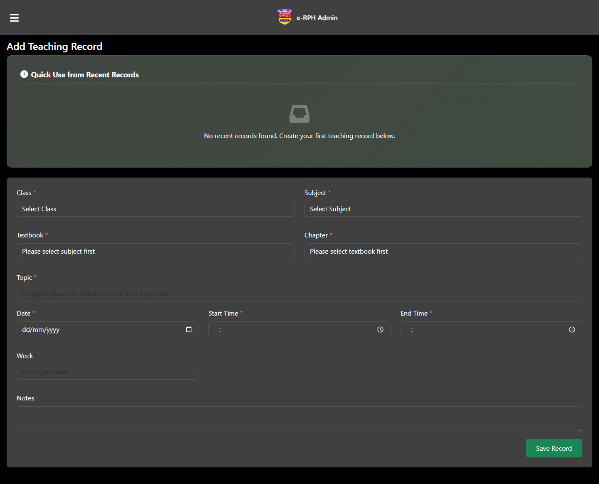
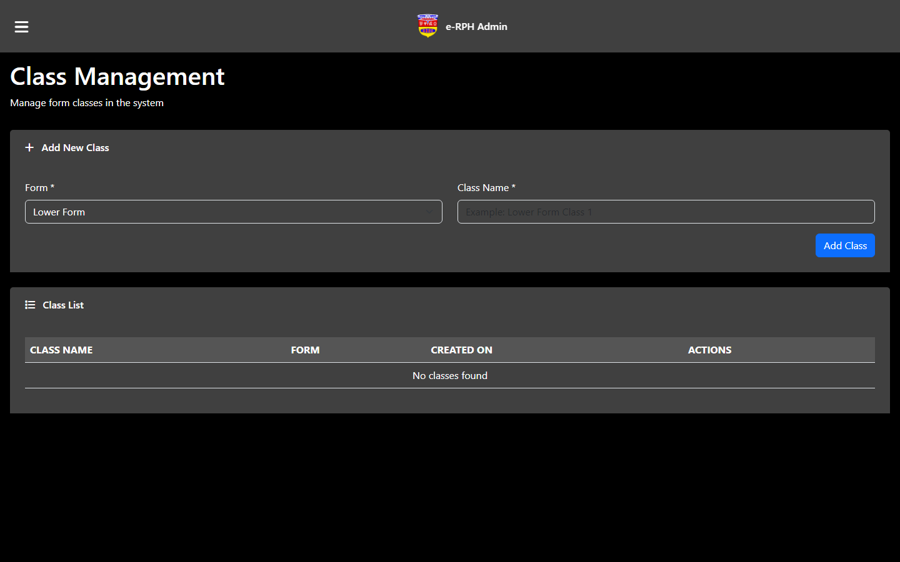
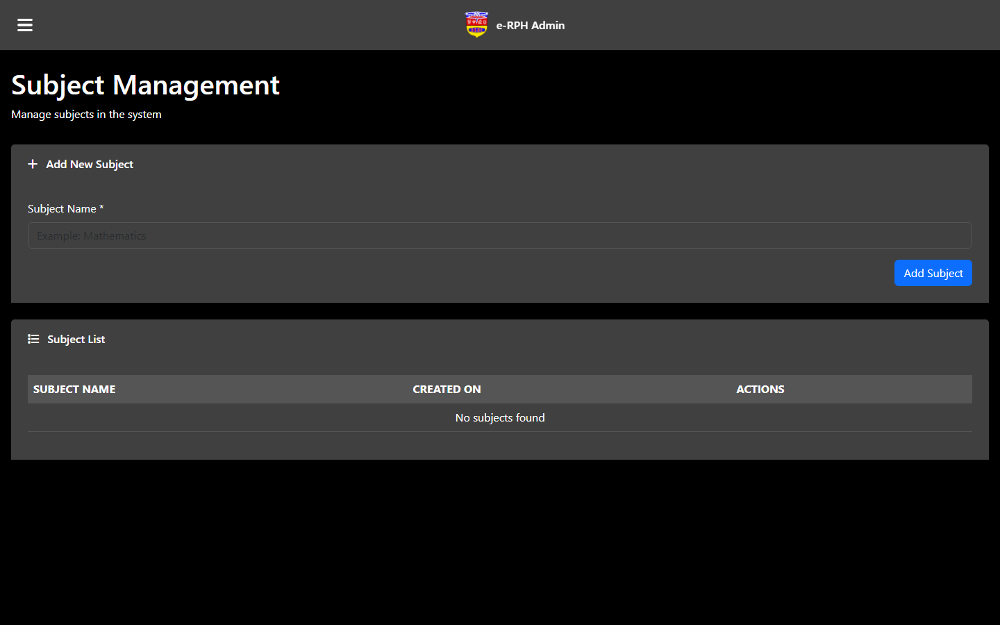
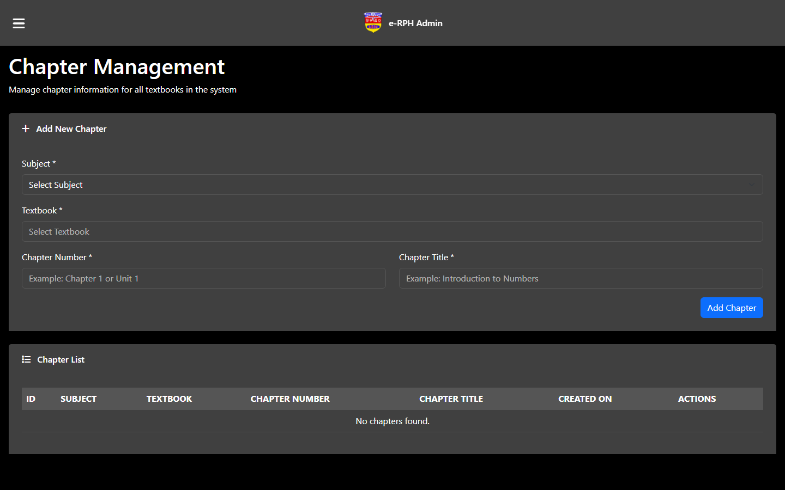
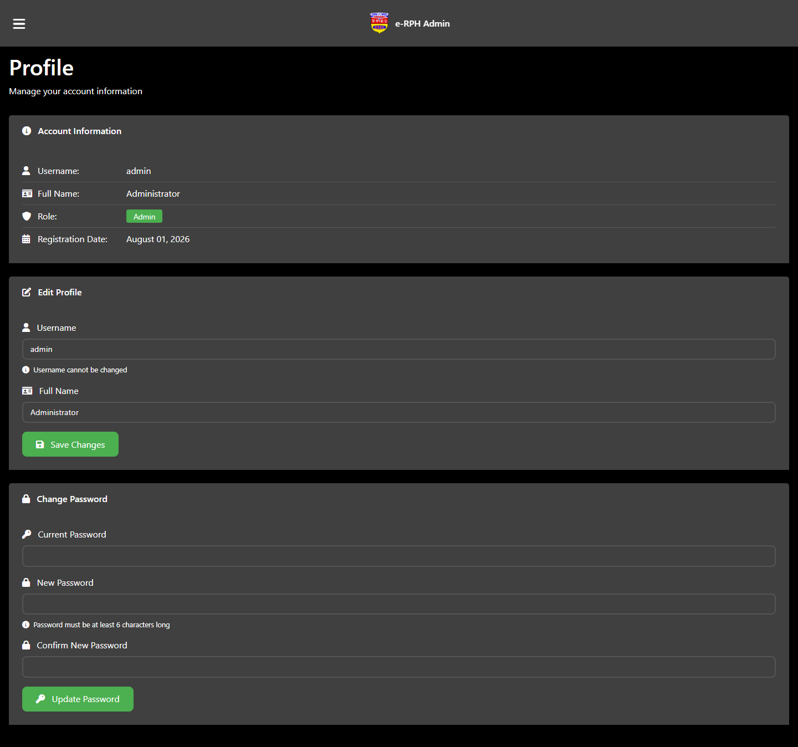
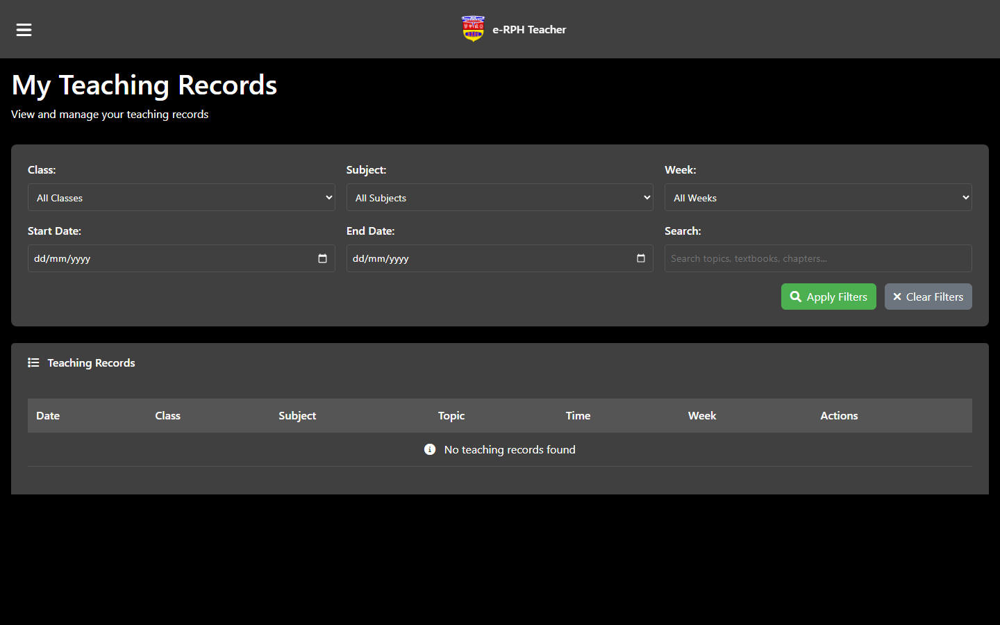
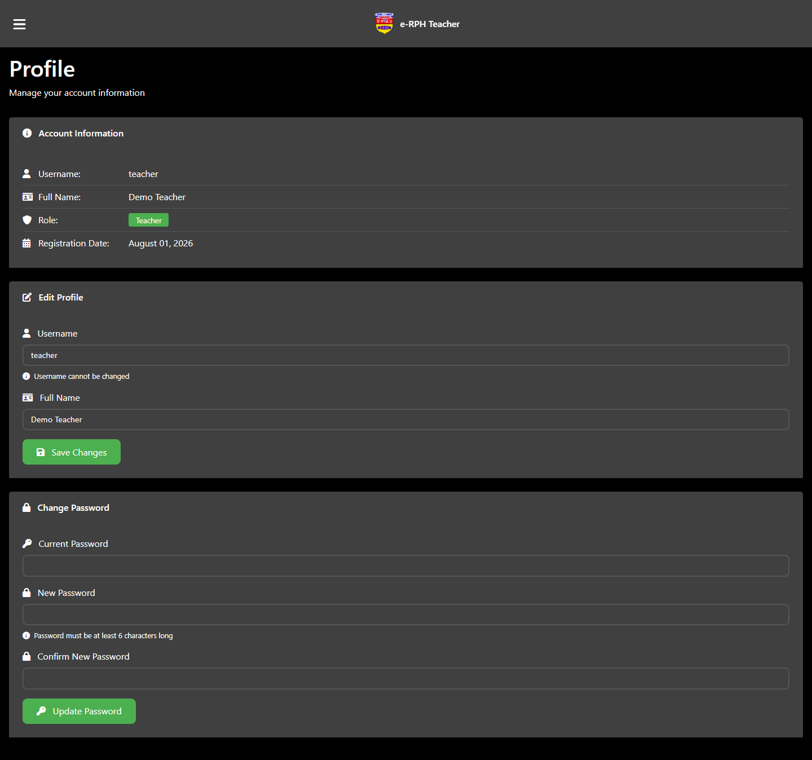

# e-RPH

School teaching-record system (Rancangan Pengajaran Harian). Admins manage users, classes, subjects, and chapters. Teachers log lessons and reports.

PHP + MySQL on XAMPP.

---

## Screenshots

### Login

Admin: `admin` / `admin123` · Teacher: `teacher` / `teacher123`

### Admin dashboard

### Teaching records

### Admin report

### Manage users

### Manage class

### Manage subject

### Manage chapter

### Admin profile

### Teacher dashboard

### Teacher records

### Teacher report

### Profile

---

## How to run

1. Start Apache and MySQL in XAMPP.
2. Import the `SQL` file in phpMyAdmin (creates `erph` and demo users).
3. Open `http://localhost/everything%20that%20work/e-RPH/index.php`

Edit `db_connect.php` if your MySQL password is not empty.
