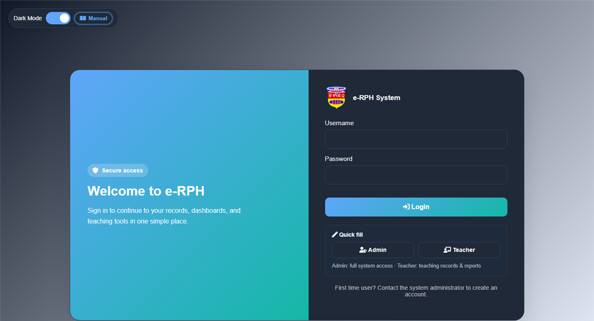
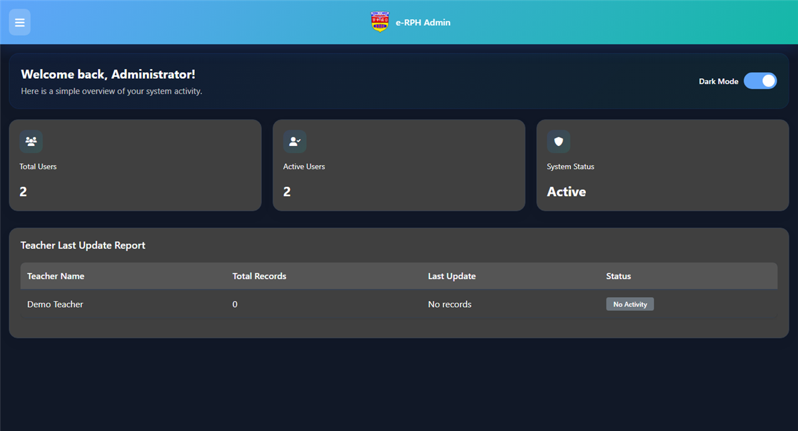
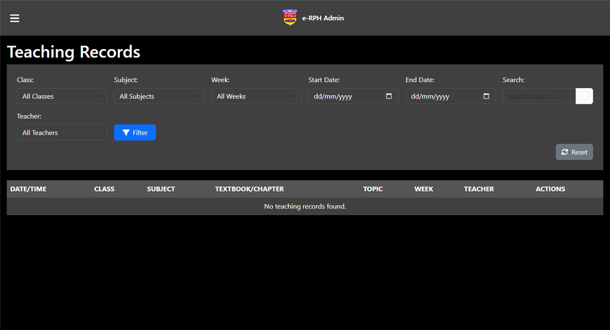
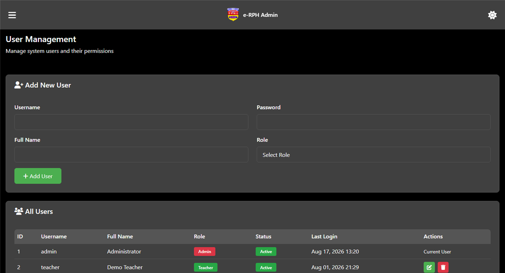
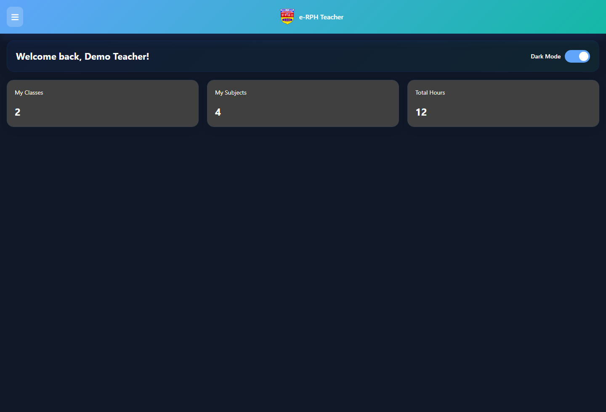
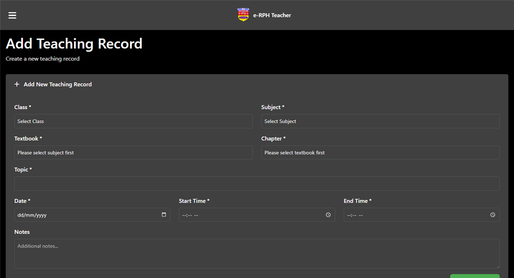

# e-RPH

School teaching-record system (Rancangan Pengajaran Harian). Admins manage users, classes, subjects, and chapters. Teachers log lessons and reports.

PHP + MySQL on XAMPP.

---

## Screenshots

### Login

Admin: `admin` / `admin123` · Teacher: `teacher` / `teacher123`



### Admin dashboard



### Teaching records



### Manage users



### Teacher dashboard



### Teacher report



---

## What you need

- XAMPP (Apache + MySQL + PHP)
- Default MySQL `root` with empty password (edit `db_connect.php` if not)

## Step-by-step setup

1. Install XAMPP and start **Apache** and **MySQL**.
2. Clone into `htdocs`:
   ```bash
   cd C:\xampp\htdocs
   git clone https://github.com/chewzees/e-RPH.git
   ```
3. Import the database:
   - phpMyAdmin → http://localhost/phpmyadmin
   - **Import** → choose the `SQL` file in this project → **Go**
   - This creates database `erph` plus demo users
4. If MySQL has a password, edit `db_connect.php` (`$db_pass`).
5. Open:
   `http://localhost/e-RPH/index.php`

Original nested path: `http://localhost/everything%20that%20work/e-RPH/index.php`

## Step-by-step usage (admin)

1. Open the login page.
2. Click **Admin** quick fill, or enter `admin` / `admin123`.
3. Click **Login**. You should reach the admin dashboard.
4. Create classes in **Manage class**.
5. Create subjects in **Manage subject**, then chapters in **Manage chapter**.
6. Create teacher accounts in **Manage users**.
7. Review records in **Teaching records** and **Admin report**.
8. Update your account in **Admin profile**.
9. Logout.

## Step-by-step usage (teacher)

1. Log in as `teacher` / `teacher123`.
2. Open the teacher dashboard.
3. Add teaching records (class, subject, chapter, topic, date, time).
4. Review your list in **User record** and reports in **Teacher report**.
5. Update **Profile**, then logout.

## If something goes wrong

- **Problem connecting to the database:** start MySQL and import the `SQL` file.
- **Login returns to the form:** username/password must match an `active` user in `erph.users`.
